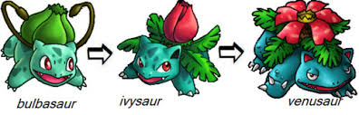
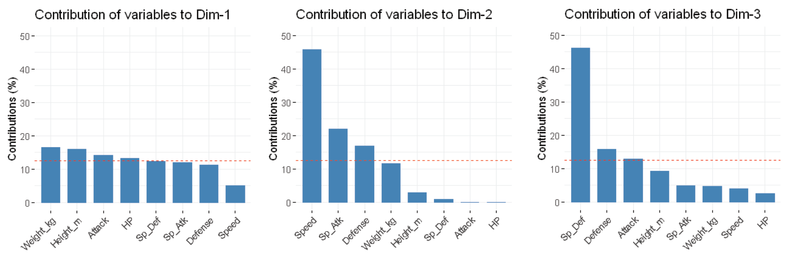
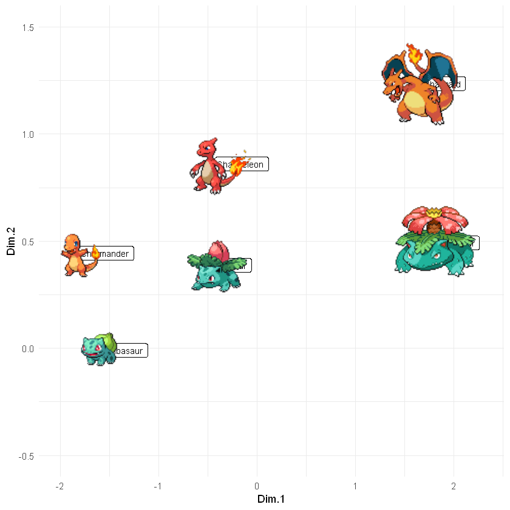
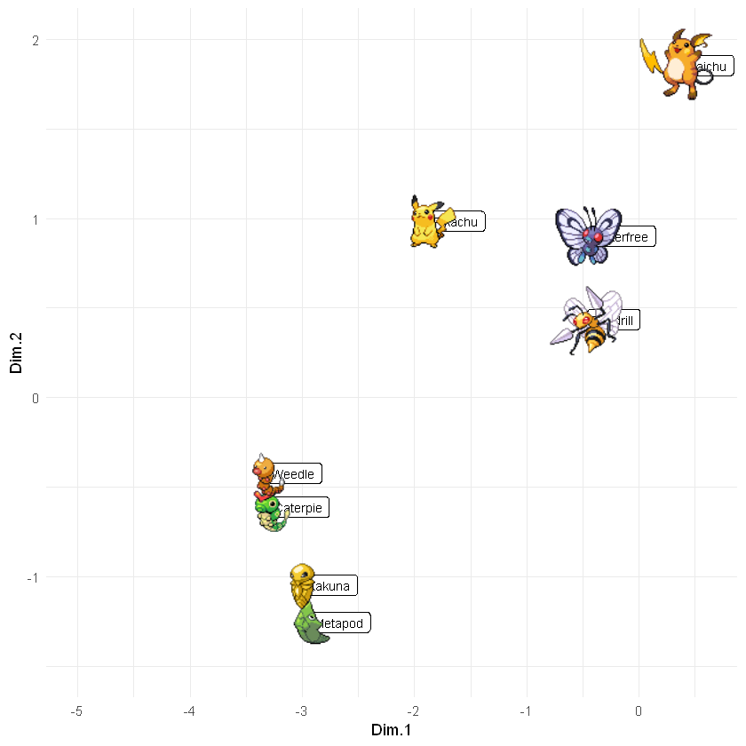

Pokémon comenzó como un juego de rol, pero debido a su creciente popularidad sus creadores terminaron
produciendo muchas series de televisión, cómics de manga, etc., así como otros tipos de videojuegos (¡como
el famoso Pokémon Go! ). 

Uno de los grandes misterios en el mundo Pokémon es el diseño de estos personajes. No se sabe a ciencia
cierta cuáles son las reglas de diseño que siguen los creadores del juego. Hoy intentaremos hallar una respuesta a múltiples aspectos del diseño mediante el análisis de componentes principales.

Otro de los misterios del mundo Pokémon es la evolución de los personajes. Este es un proceso
que transforma en una o tres fases al personaje en una versión mejorada de sí mismo. Se sabe que
no todas las especies evolucionan de la misma forma...

 

### Análisis de componentes principales (PCA)

Cada Pokémon tiene 6 estadísticos, una variable de peso y otra de altura. Para tener una idea sobre en
qué se basan los diseñadores de Pokémon para asignarle un valor u otro a cada personaje usaremos PCA.
Mediante esta técnica de reducción de la dimensión obtendremos las variables latentes que resumen la
información de nuestros datos.

Antes de hacer el análisis de componentes principales se han escalado las distribuciones de los estadísticos
y del peso y altura.

#### Varianza explicada

En la siguiente imagen vemos la varianza explicada por las componentes principales. Para decidir con qué
componentes nos quedaremos vamos a inspeccionar un poco estas mediante las contribuciones ya que nos
interesa que las componentes sean interpretables.

#### Buscando la interpretabilidad

- **Componente 1**: Parece que la componente 1 es una medida global del Pokémon, pues las variables que
  más contribuyen son; el peso, la altura, los puntos de salud, el ataque, etc. Es decir, casi todos los estadísticos
  del Pokémon. A un mayor valor de componente 1 mejores serán los 8 estadísticos de nuestro
  Pokémon.
- **Componente 2**: La componente 2 nos está dando una medida global del ataque del Pokémon. Las variables
  que más contribuyen en este caso son; la velocidad, los puntos de ataque especial y la defensa (pero
  poco). Podemos decir que a un mayor valor en la componente 2, nuestro personaje tendrá un mejor ataque.
- **Componente 3**: La tercera componente nos está dando una medida global de la defensa del Pokémon ya
  que las variables que más contribuyen son las de defensa y la de special defense. Por ello, a un mayor valor
  en la dimensión 3 mejor se defenderá nuestro Pokémon.

Las siguientes dimensiones son (en cuanto a interpretabilidad) versiones muy similares de las anteriores.
Además, sus autovalores son mucho menores que 1, el de la dimensión 4 es de 0,73, por ello,  no las usaremos en el **Pokeanálisis**.

#### Scores - Catch Rate

Este gráfico es un scatterplot del score1 frente al score2. Si coloreamos el gráfico según la variable
*Catch_Rate* que es el ratio de captura del Pokémon podemos observar que según se avanza
en el eje x, es decir, en la dimensión 1 la probabilidad de capturar al Pokémon disminuye. Como la dimensión
1 habíamos dicho que era una medida de lo bueno que es el Pokémon, podemos decir que la
probabilidad de capturar un Pokémon disminuye a medida que aumenta su puntuación en diferentes características.

#### Biplot - IsLegendary

Este gráfico es una combinación del gráfico de loadings y el de scores. Las variables originales
se representan en forma de vector. En el gráfico se ha diferenciado entre los Pokémons legendarios y los que no lo son, pero... ¿qué es un pokémon legendario?

> Un Pokémon legendario es una criatura que destaca por su poder único y excepcional, en comparación
> con el resto de los Pokémon. Generalmente los Pokémon legendarios forman parte
> de una leyenda o mito Pokémon y suelen destacar por la dificultad que conlleva su obtención. **pokemon.fandom.com**

De acuerdo con esta descripción los Pokémon que son legendarios deberían tener valores muy altos en la
dimensión 1 ya que esta es la que captura lo bueno que es el espécimen. Si observamos el *biplot* siguiente
podemos ver que así es.

#### Evoluciones!!💥

En el siguiente gráfico de scores vamos a intentar observar un fenómeno que ocurre en los pokémons
conocido como evolución.

> La evolución es una fase por la que pasan la mayoría de los Pokémon durante su crecimiento y
> entrenamiento. Los animales crecen y se desarrollan cambiando algunas de sus características,
> a los Pokémon les pasa igual, pero sus cambios son por lo general mucho más pronunciados.
> Habitualmente, cuando un Pokémon evoluciona también aumentan sus características, aunque
> esto no ocurre siempre así. **pokemon.fandom.com**

Para comprobar si podemos apreciar la evolución en nuestros especímenes vamos a analizar dos líneas
evolutivas diferentes:

-  Charmander 👉 Charmaleon 👉 Charizard
- Bulbasaur 👉 Ivysaur 👉 Venusaur

Vamos a obtener los scores de estas dos líneas y los mostraremos en un gráfico donde el eje x será la
dimensión 1, que actuará como medida global de cuán bueno es el Pokémon y el eje y será la dimensión 2
que nos resumirá el ataque del personaje.

En el gráfico anterior vemos de forma muy clara el fenómeno de la evolución. A medida que mejora nuestra
especie, esta va ganando puntos en diferentes características y ataque; esto se refleja en la dimensión 1 y 2
respectivamente.

##### Casos particulares de evolución: insectos

Hay casos particulares en las evoluciones en las que el Pokémon se vuelve muy débil en la fase intermedia,
este es el caso de los insectos. Al igual que los insectos en la vida real, estos pasan por una metamorfosis
y en la etapa intermedia suelen ser larvas, es en esta etapa cuando sus puntos de ataque, defensa etc.
disminuyen, lo podemos ver en la siguiente gráfica donde se analizan dos evoluciones de insectos frente a
la evolución de Pikachu.

- Weedle 👉 Kakuna 👉 Beedrill ✋ **Insecto**
- Caterpie 👉 Metapod 👉 Butterfree ✋ **Insecto**
- Pikachu 👉 Raichu

Vemos como en la evolución de estos insectos, en la fase intermedia disminuye su ataque (dimensión2) y
no aumentan demasiado las demás características (dimensión 1), en la última fase se da un gran salto y se
aumenta el ataque y los demás estadísticos. En cambio, en la evolución de Pikachu (que solo tiene dos, de
momento. . . ) esto no ocurre así.

