##### Kaggle kernel: <a href="https://www.kaggle.com/javier048/understanding-popularity-with-pls" target="_blank" rel="noopener">Understanding-popularity-with-pls</a>

Spotify es una aplicación de música con miles de canciones. Hoy nos centraremos en analizar cuáles son las variables que influyen en la popularidad de una canción mediante el método PLS.

Brevemente, PLS es un método supervisado de regresión. Se trata de un método de reducción de la dimensión al igual que otros como PCR. Pero a diferencia de PCR, PLS obtiene las variables latentes de forma supervisada, es decir, hace uso de la variable o variables Y. De esta forma, no solo obtiene un subespacio que aproxima bien a la nube de puntos sino que además estas variables latentes estarán relacionadas con la variable respuesta.

## Dataframe

El dataset contiene más de 160.000 canciones extraídas de la web de Spotify;  <a href="https://developer.spotify.com/documentation/web-api/reference/tracks/get-audio-features/" target="_blank" rel="noopener">Link🎵 </a> . Las variables se detallan en la web y son las siguientes:

**Features:**

- **acousticness** [0 - 1]: Métrica que hace referencia a lo acústica que es la canción; un valor de 1 indica que la canción es muy acústica
- **danceability** [0 - 1]:  Métrica que hace referencia a lo bailable 💃 que es la canción. La métrica se basa en una combinación de variables como;  tempo, rhythm stability, beat strength, y overall regularity. Un valor de 0.0 indica que la canción no es bailable mientras que un valor de 1.0 indica que la canción es muy bailable
- **energy** [0 - 1]: La energía de la canción. Las canciones muy energéticas son rápidas, ruidosas y sonoras. Por ejemplo, una canción de metal o de rock incluso tienen una alta energía, mientras que una pieza de Bach no tiene un valor tan alto en energía. Las variables en las que se basa esta variable son: dynamic range, perceived loudness, timbre, onset rate, y general entropy
- **duration_ms** [200k - 300k]: La duración de la canción en milisegundos
- **instrumentalness** [0 - 1]: Métrica que hace referencia a lo instrumental de la canción. Predice si una canción no contiene voz. En este caso, 'ooh' y 'aah' son tratadas como instrumental. Por ejemplo, una canción de rap tendrá un valor muy bajo en esta métrica. Cuánto más cercano a 1.0, mayor probabilidad de que la canción no contenga voz alguna
- **valence** [0 - 1]:  Métrica que hace referencia a la positividad de la canción. Canciones con un alto valor de valence suenan más positivas, mientras que canciones con valores bajos de valence suenan más negativas
- **popularity** 
- **tempo** [50 - 150]: El ritmo medio medido en beats per minute (BPM). El tempo es la velocidad de una pieza
- **liveness** [0 - 1]: Detecta la presencia de público en la grabación. Altos valores de liveness indican que hay una alta probabilidad de que la canción haya sido grabada con público
- **loudness** [-60 - 0]: El volumen medio de una canción medido en decibelios (dB)
- **speechiness** [0 - 1]:  Métrica que hace referencia a la presencia de palabras en una canción. Por ejemplo, un audiolibro o un poema tendrán unos valores muy cercanos a 1.0. Valores por encima del 0.66 serán canciones habladas, valores entre 0.33 y 0.66 serán canciones que combinen música con voz, valores menores de 0.33 serán canciones donde no haya voz alguna
- **year** [1921 - 2020]
- **explicit** [0 = No explicit content, 1 = Explicit content]:  Variable dicotómica que indica si una canción contiene letras 'explícitas' o no

Como nuestro objetivo no es obtener un buen modelo de regresión para predecir, sino para discriminar la popularidad, **no** se realizará ninguna validación cruzada. Por otro lado, nuestra variable respuesta será la popularidad y las variables regresoras serán; **acousticness, danceability, duration_ms, energy , explicit, instrumentalness, liveness, loudness, mode, speechiness, tempo and valence.**

## PLS

Los métodos de reducción de la dimensión como PCR, PCA o PLS facilitan mucho el tratamiento de datos correlacionados. Sin embargo, PLS tiene una serie de propiedades comparado con otros métodos como los random forests, las redes neuronales... PLS no modela únicamente la relación entre el espacio X y el espacio Y como lo hacen otros métodos de caja-negra, además PLS proporciona modelos tanto para el espacio X como el espacio Y.

La principal diferencia comparado con PCA es que en PCA se proyectan las observaciones en un subespacio de forma que se maximiza la varianza de la variable latente, mientras que en PLS se trata de maximizar la covarianza entre los espacios X e Y. Ello significa que las variables latentes explicarán la variabilidad en X relacionada con la variabilidad en Y.  Debido a que la cov(X, Y) no es más que el producto de las desviaciones típicas de X, Y y la correlación de X e Y, estaremos maximizando la correlación entre los espacios X e Y.

### Algoritmo PLS

Empezamos con dos matrices; X e Y. Ambas deben ser centradas y escaladas antes de que empiece el algoritmo.

**`Paso 1`** Establecemos **u** como la primera columna de **Y** o la columna de máxima varianza

**`Paso 2`** Predecimos las columnas de **X** usando **u**

**`Paso 3`** Predecimos las filas de **X** usando **w**

**`Paso 4`** Predecimos las columnas de **Y** usando **t**

**`Paso 5`** Predecimos las filas de **Y** usando **c**

Repetimos 1,2,3,4,5 hasta la convergencia. Por ejemplo, hasta que u es muy parecido al u de la iteración anterior

6. En la convergencia, predecimos las columnas de **X** usando **t**

7. Matrices de residuos

E es la matriz de residuos de X y F la matriz de residuos de Y. Las nuevas iteraciones empiezan con X e Y como las matrices de residuos de la anterior iteración. Por ello, se extrae una dimensión por iteración.

### Interpretación

Las componentes PLS crean dos subespacios; uno en el espacio Y y otro en X. Cuando se proyectan las observaciones <mark>se obtienen dos scores diferentes; t y u</mark>, los scores en el espacio X y los scores en el espacio Y respectivamente.

- u: Scores del espacio Y. u es una combinación lineal de Y y c
- t:  Scores en el espacio X. t es una combinación lineal de X y w
- c:  Loadings en el espacio Y. Los loadings c son los coeficientes de correlación entre las variables en Y y t
- w: Loadings en el espacio X. Los loadings w son los coeficientes de correlación entre las variables X y u. Aquellas variables en X que estén altamente correlacionadas con Y tendrán un loading alto en w

Si una variable x1 tiene un alto valor en su peso w, quiere decir que esa variable está muy relacionada con el score u pero como los scores u son combinación lineal de las variables Y con pesos c, querrá decir que esa variable x1 estará relacionada con aquellas variables Y que tengan altos valores en c. En otras palabras, si una variable z en X tiene un alto loading en w y otra variable o en Y tiene un alto valor en c; z estará correlacionada con o.

### Selección de componentes

Una forma de seleccionar componentes PLS es analizando el Q2 y R2 para cada componente. Se decide parar de escoger componentes cuando el Q2 empieza a decrecer. En nuestro caso, usaremos únicamente las tres primeras componentes. Si quisiéramos un modelo para predecir  la popularidad deberíamos escoger más componentes PLS ya que el Q2 mide la capacidad predictiva del modelo y en el siguiente gráfico se observa que el valor Q2 aumenta tras cada componente.

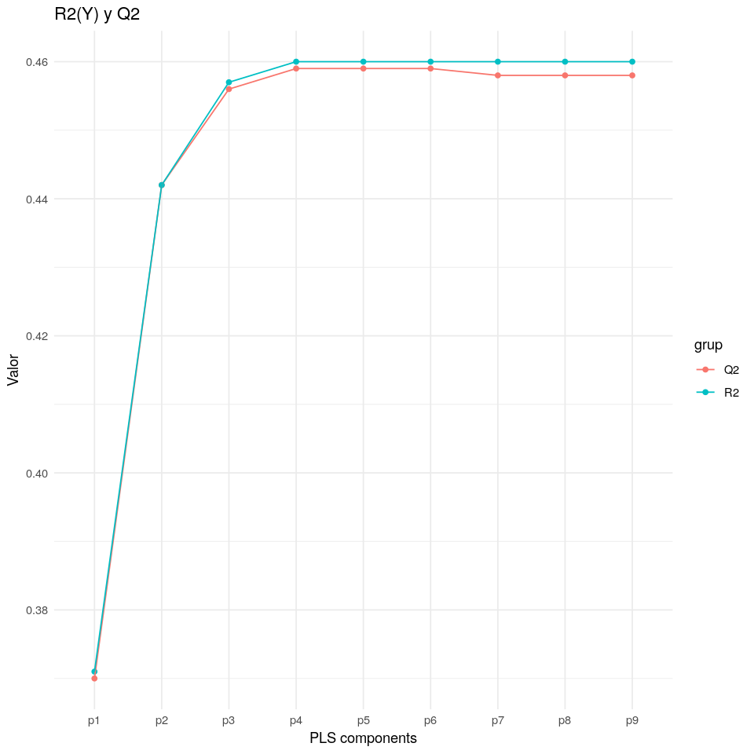

### SPE

Tras realizar un modelo PCA o PLS se deben analizar los residuos del modelo. La parte residual de una observación puede reducirse a un único número; el SPE (sum of predicted errors):

 

Donde e es el vector de residuos de una observación. Una observación en X con un SPE = 0 es una observación que se encuentra justo en el hiperplano definido por el modelo, mientras que una observación con un alto SPE, se alejará mucho del hiperplano. En PLS nos encontraremos con dos tipos diferentes de SPE; una clase de SPE para el espacio Y que se calculará usando la matriz de residuos F y otra clase de SPE para el espacio X. En este caso vamos a centrarnos únicamente en el SPE para el espacio X. 

Podemos calcular un límite de confianza, por debajo de este esperaremos encontrar una fracción de los datos. Este es el límite chi2;

 

En el siguiente gráfico se muestra el SPE para cada observación con el límte del 99% de confianza. Aquellas observaciones que superen dicho límte deberán ser eliminadas y se recalculará el modelo.

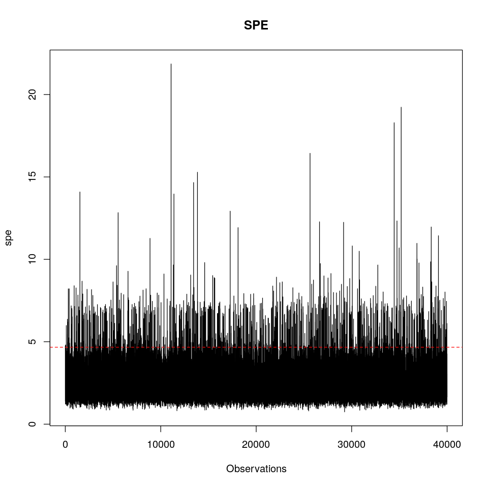

### T2-Hotelling

El estadístico T2 es un *resumen* de todos los scores t en todas las A dimensiones (3 en nuestro caso). El T2 es la distancia desde el centro del hiperplano a la proyección de la observación. Una proyección que esté justo en el centro del hiperplano, tendrá un valor T2 = 0. Las observaciones que tengan valores muy cercanos al centroide de los datos, tendrán valores T2 muy bajos. *Dato curioso;* el estadístico T2 es equivalente a la distancia Mahalanobis de una proyección a la media.

 

Donde A es el número total de componentes y sa es la varianza para cada componente. En PCA sería el valor propio asociado a la componente.

El estadístico T2 se distribuye como una distribución F de Snedecor. Por ello, podemos calcular un límite de confianza del 95% por debajo del cual esperamos encontrar el 95% de las observaciones. Por tanto, una observación Ti estará por encima de este límite cuando:

 

Como se observa en el siguiente gráfico, existen observaciones que sobrepasan el límite del 99%. Al igual que antes con el SPE, estas observaciones anómalas se eliminarán y el modelo se recalculará.

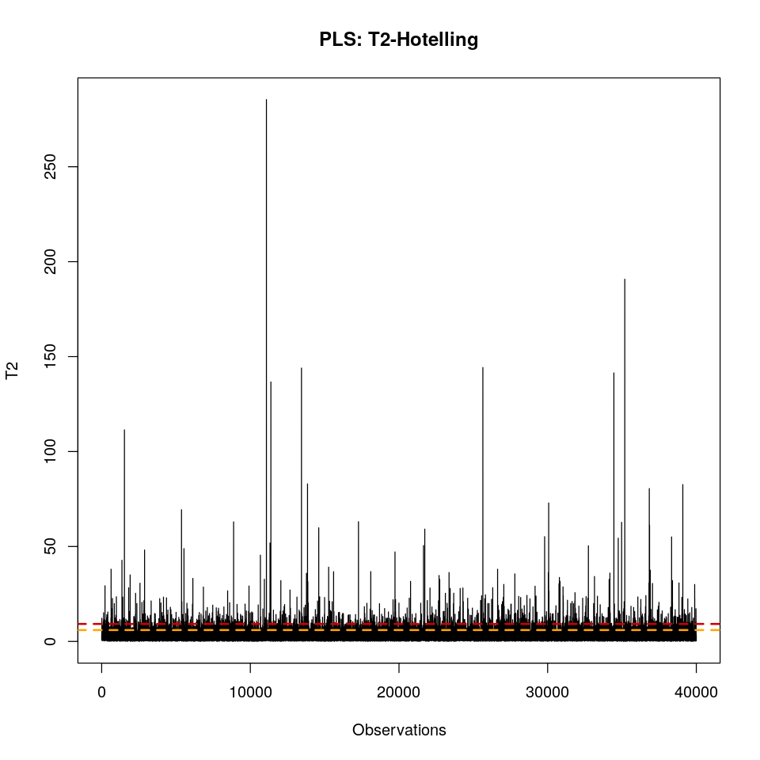

### R2X

Para interpretar los gráficos de loadings o de scores, primero se debe observar el valor R2 para cada variable distinguiendo entre componentes. El R2 nos indica la variabilidad de una variable k explicada por el modelo. El R2 puede calcularse como:

 

 

El siguiente gráfico muestra que:

- **acousticness:** Principalmente explicada por la primera componente
- **danceability:** Explicada por las tres pero especialmente por la tercera
- **duration_ms:** Explicada por las tres pero especialmente por la tercera
- **energy:** Principalmente explicada por la primera componente
- **explicit:** Principalmente explicada por la primera componente
- **instrumentalness:** Principalmente explicada por la primera componente
- **liveness:** Principalmente explicada por la segunda y tercera componente 
- **loudness:** Principalmente explicada por la primera componente
- **mode:** A penas está explicada por nuestro modelo
- **speechiness:** Principalmente explicada por la segunda componente
- **tempo:** Explicada por la primera y segunda componente
- **valence:** Principalmente explicada por la segunda componente

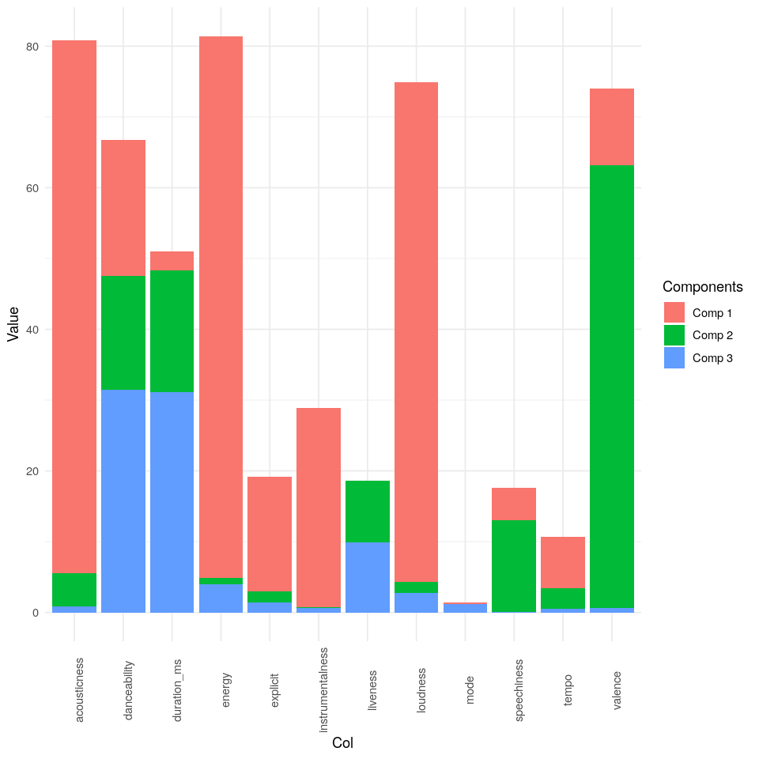

### Loadings

Esta es la parte más interesante. Con los loadings se puede interpretar la relación existente entre variables en el espacio X, Y o en ambos a la vez. En el siguiente gráfico se van a superponer dos gráficos diferentes; los loadings en el espacio X y los loadings en el espacio Y.

#### w1\*c1/w2\*c2

La primera componente PLS está correlacionada positivamente con danceability, energy y loudness y de forma negativa con acousticness en el espacio X. En el espacio Y, la primera componente se correlaciona de forma positiva con Popularity. Ello significa que una observación que sea popular presentará altos valores en la primera componente. Por otra parte, la segunda componente PLS se correlaciona de forma negativa con valance, speechiness, acousticness y iveness en el espacio X y se correlaciona de forma positiva con popularity en el espacio Y.

Podemos observar diferentes relaciones en el siguiente gráfico:

- Popularity se correlaciona de forma negativa con acousticness, ya que ambas variables se encuentran formando un ángulo de 180°
- Popularity se correlaciona de forma positiva con danceability, duration_ms, energy, explicit y loudness
- Speechiness  y liveness se correlacionan de forma negativa con instrumentalness (como cabría esperar)
- Acousticness se correlaciona de forma negativa con danceability, duration_ms o explicit

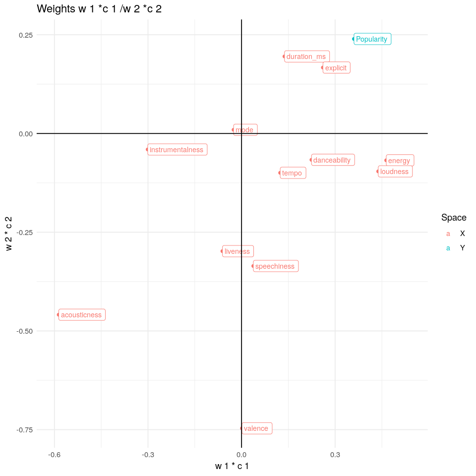

#### w1\*c1/w3\*c3

Esta nueva tercera componente está correlacionada de forma positiva con danceability y de forma negativa con acousticness o duration_ms en el espacio X. Por otra parte, se correlaciona de forma positiva con Popularity en el espacio Y. Además, se observa que danceability está correlacionada negativamente con acousticness.

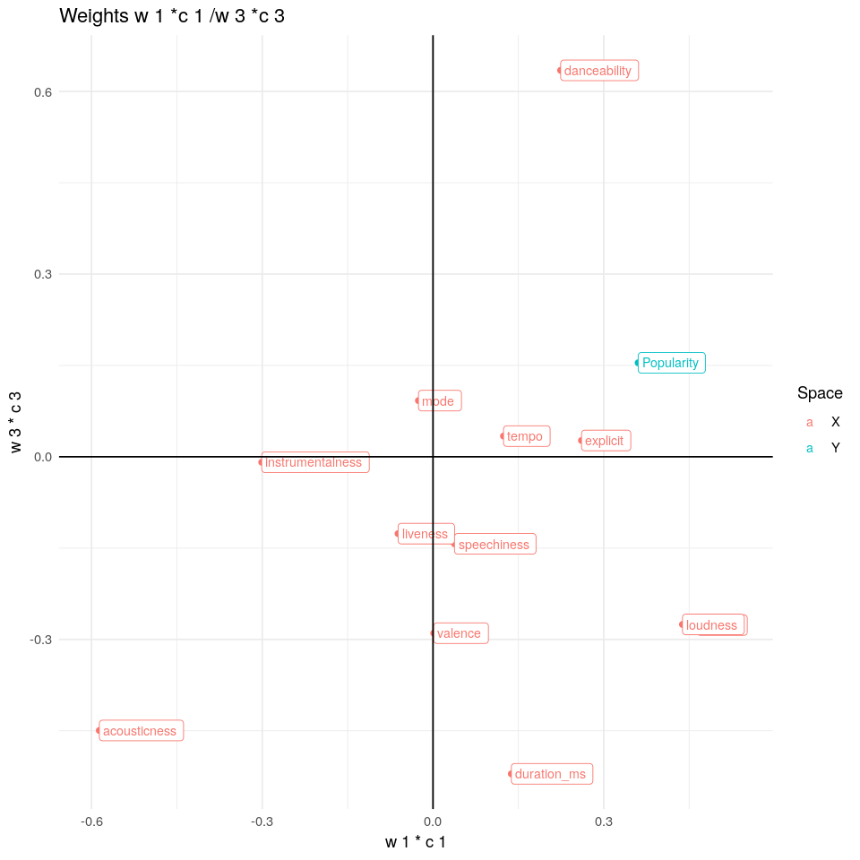

### Scores

#### t1/t2

Como ya se ha dicho, los scores son las proyecciones de las observaciones en el nuevo subespacio creado por el modelo. Este gráfico es complementario al visto antes; wn\*cn/wn\*cn. Por ello, si coloreamos los scores t1/t2 según el valor de Popularity podemos ver un gradiente (de menos a más popularidad), indicando la dirección de Popularity vista en el gráfico de loadings. Ahora, si coloreamos los scores t1/t2 según acousticness observaremos el gradiente opuesto ya que acousticness  se correlaciona de forma negativa con Popularity.

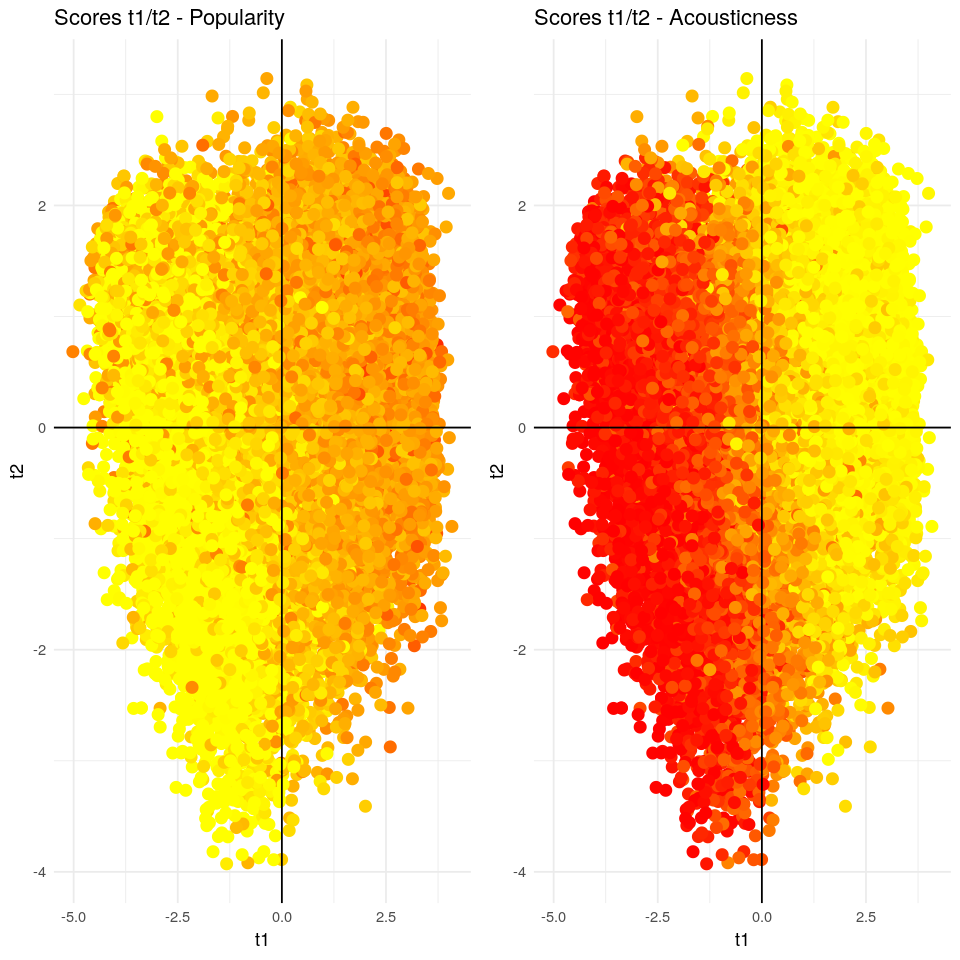

No hemos introducido la variable *año* en el modelo, así que... ¿qué ocurre si coloreamos los scores según año? Si lo hacemos se observa un gradiente de color moviéndose hacia la dirección de popularity, como el gradiente visto antes. Esto significa que las canciones más populares son a su vez las más recientes. Además, este gradiente nos revela también que las canciones han ido aumentando en  danceability, energy, loudness o duration_ms a lo largo de los años y disminuyendo en acousticness.

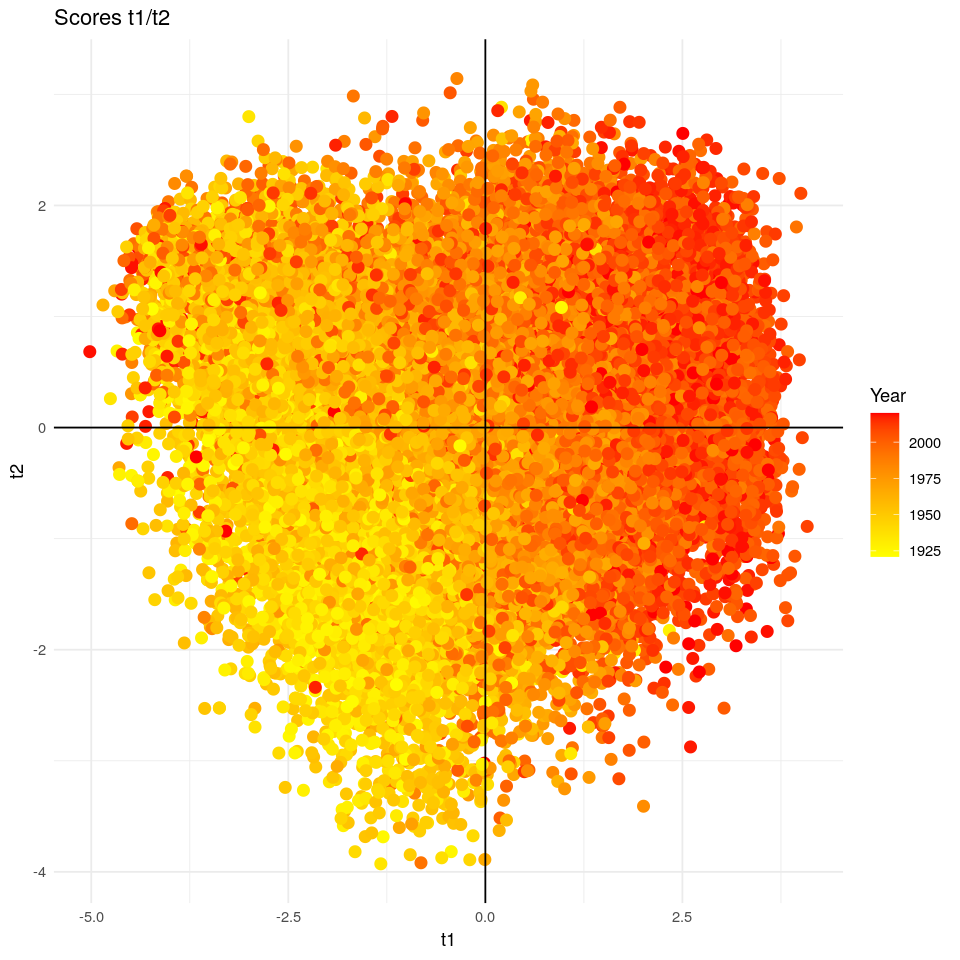

#### Interpretando algunos scores

Para poder comprender mejor lo que nuestro modelo está haciendo, seleccionaremos 20 canciones aleatorias y analizaremos algunos scores usando los gráficos de loadings vistos antes.

Por ejemplo, *La Boa (La Sonora Santanera)*, esta observación tiene un valor muy alto en la segunda componente PLS, ello significa que esta canción tendrá un valor elevado en valence, liveness y speechiness. Si vemos el vídeo de esta canción... <a href="https://youtu.be/X-Xqqwa4o-E" target="_blank" rel="noopener">La BOA💥</a> observaremos que esta es una actuación en directo y en mi opinión, bastante positiva😏 Es la boa, es la boa, es la boa...🐍 Por el contrario, hay otra canción llamada *War Is Declared / The Death of Charles* que observando el gráfico t1/t3 se podría decir que no será bailable, será larga y tendrá un alto valor de acousticness... <a href="https://youtu.be/NMaLxivGCqc" target="_blank" rel="noopener">War Is Declared</a>.

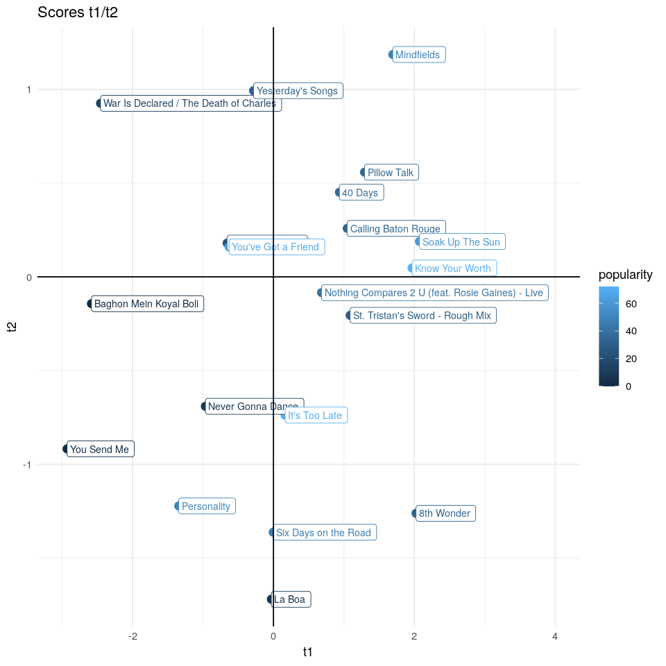

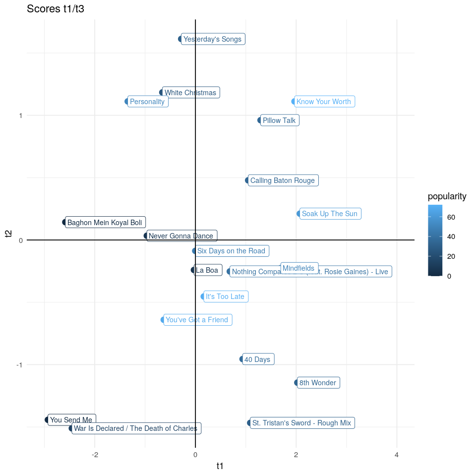

### Coeficientes de regresión PLS

Un modelo PLS puede ser escrito como un modelo de regresión de la forma; Y = yt + X BPLS + F. No entraré en demasiados detalles sobre cómo se obtiene la matriz BPLS, pero esta matriz tiene k filas (k es el número de variables de X) y m columnas (m es el número de variables de Y). Así, para cada variable en Y existen unos coeficientes que nos indican la influencia de cada variable en X. Estos coeficientes facilitan la interpretación del modelo, la desventaja es que se pierde información sobre la estructura de correlación.

En el siguiente gráfico tenemos los coeficientes para la variable respuesta; Popularity. Observamos que las principales variables que disminuyen la popularidad de una canción son valence y acousticness, seguidas en menor medida por instrumentalness, liveness y speechiness. Por otra parte, las principales variables que incrementan la popularidad de una canción son danceability, energy, explicit y loudness. Tempo, mode y duration no parecen ser significantes.

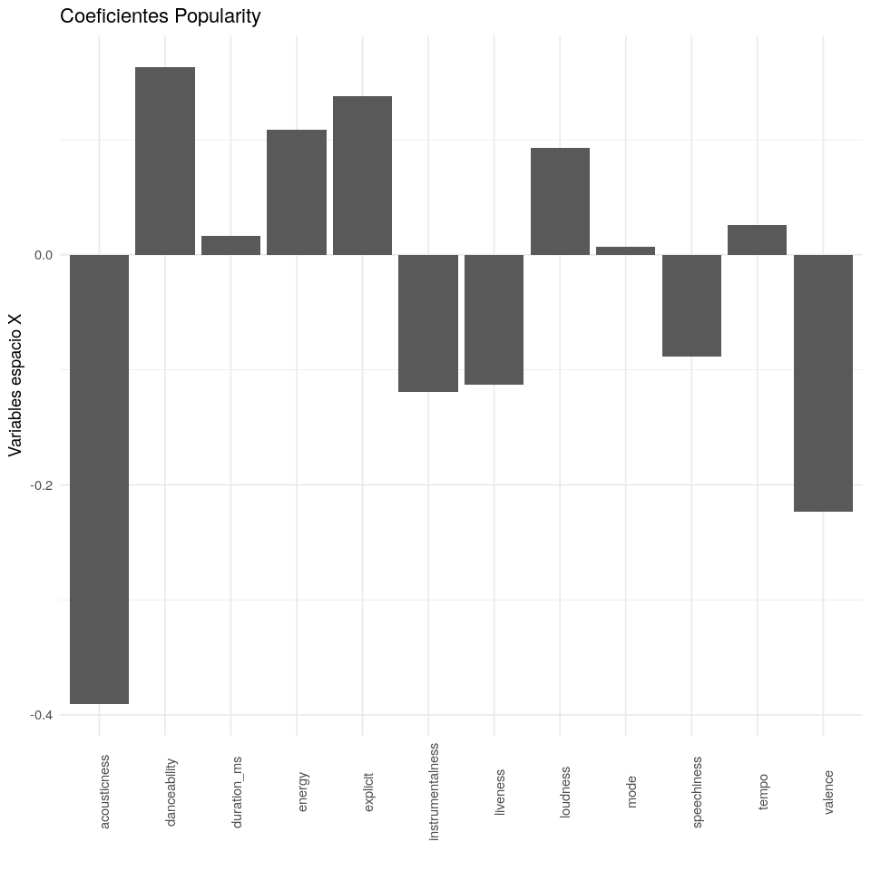

### Bob Marley vs Mozart

Si proyectamos todas las canciones de Mozart o Bob Marley sobre las componentes PLS, observaremos una clara diferencia en sus scores. Probablemente, deberíamos hacer un Análisis de Componentes Principales para ver una diferencia más clara ya que nuestros scores van a estar sesgados por popularity. Aun así, se observa una clara diferencia entre ambos músicos usando los scores PLS. Mozart tiene valores elevados de instrumentalness o duration_ms, mientras que Bob Marley tiene valores elevados de tempo, danceability, loudness, energy...

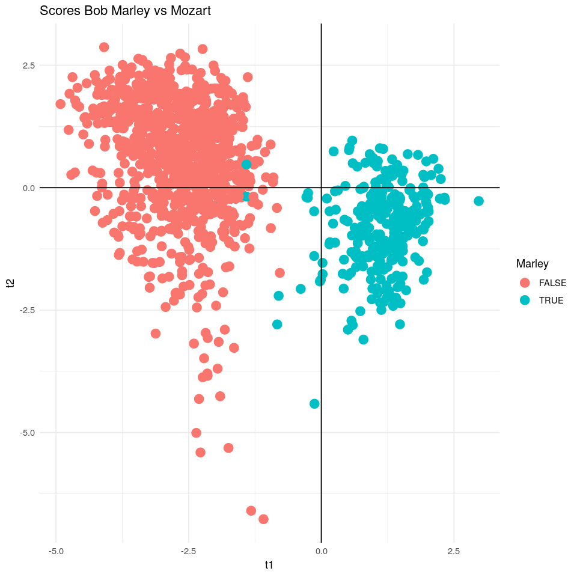

Si los coloreamos según año, no se observa ningún gradiente de color en el caso de Bob Marley, pero sí en el caso de Mozart. Esto significa que sus canciones han aumentado en instrumentalness a lo largo de los años.

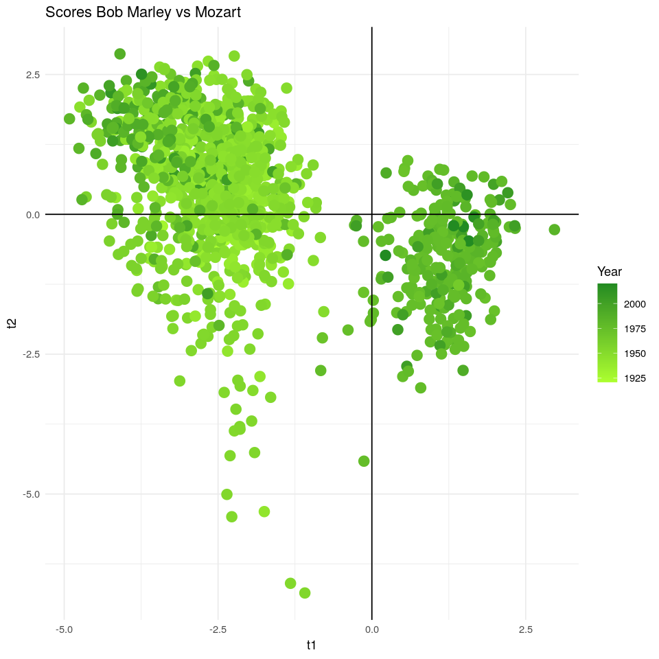

